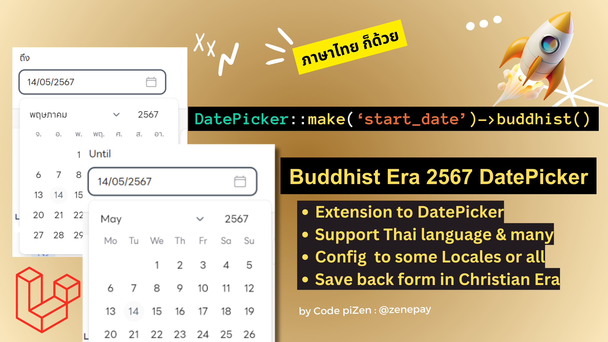
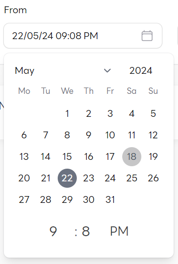

<p align="center">
    
</p>

# Filament Buddhist DatePicker/DateTimePicker Extension

[](https://packagist.org/packages/zenepay/filament-buddhist-date-picker)
[](https://packagist.org/packages/zenepay/filament-buddhist-date-picker) 
[](https://packagist.org/packages/zenepay/filament-buddhist-date-picker) 
[](https://packagist.org/packages/zenepay/filament-buddhist-date-picker)

This package adds buddhistEra support to filament v3 `DatePicker` and `DateTimePicker`.<br>
https://filamentphp.com/docs/3.x/forms/fields/date-time-picker

## Installation

You can install the package via composer:

```bash
composer require zenepay/filament-buddhist-date-picker
```

## Usage
### 1. For all languages in Buddhist year
```php
use Filament\Forms\Components\DatePicker;
use Filament\Forms\Components\DateTimePicker;

DatePicker::make('start_date')->buddhist();
DateTimePicker::make('start_date')->buddhist();

```
### 2. For all Thai language in Christian year
```php
use Filament\Forms\Components\DatePicker;
use Filament\Forms\Components\DateTimePicker;

DatePicker::make('start_at')->buddhist(false);
DatetimePicker::make('start_at')->buddhist(false);
```
### 2. For some languages in Buddhist year
```php
use Filament\Forms\Components\DatePicker;
use Filament\Forms\Components\DateTimePicker;

DatePicker::make('birth_date')->buddhist(onlyLocales:['th','en']);
DateTimePicker::make('birth_date')->buddhist(onlyLocales:['th','en']);

```
### 3. For display weekdays Min or set weekdaysMin:false for weekdays Short format

```php
use Filament\Forms\Components\DatePicker;
use Filament\Forms\Components\DateTimePicker;

DatePicker::make('start_at')->buddhist(lyLocales:on['th','en'],weekdaysMin:true);
DatetimePicker::make('start_at')->buddhist(onlyLocales:['th','en'],weekdaysMin:true);
```
You can also use this way

```php
use Zenepay\FilamentBuddhistDatePicker\BuddhistDatePicker;

BuddhistDatePicker::make('start_date');
BuddhistDatePicker::make('birth_date')->onlyLocales(['th','en'])->weekdaysMin(false);

```

Or make alias to DatePicker and replace use Filament\Forms\Components\DatePicker to use Zenepay\FilamentBuddhistDatePicker\BuddhistDatePicker as DatePicker
```php
//use Filament\Forms\Components\DatePicker -->
use Zenepay\FilamentBuddhistDatePicker\BuddhistDatePicker as DatePicker;


DatePicker::make('start_date');
DatePicker::make('birth_date')->onlyLocales(['th','en'])->weekdaysMin(false);

```

### 4. For who might love AM/PM hour mode
For Datetime format with AM PM 12H, which was available at https://github.com/filamentphp/filament/pull/6441, now it can be combined with Buddhist Era as optional.
```php
use Filament\Forms\Components\DateTimePicker;

DatetimePicker::make('start_at')->hourMode(12)->displayFormat('d/m/y h:i A')->seconds(false); // 15/02/24 11:10 PM 


```

<p align="center">
    
</p>

### 5. Use Buddhist Era in TextColumn in table
This can be done by replace $table->date() with $table->buddhistDate() for dateTime replace with $table->buddhistDateTime()
```php

TextColumn::make('start_at')->buddhistDate(format:'m/d/Y',onlyLocales:['th']); // 15/02/2567


```

## Demo & Show Case

- [Water Billing](https://zoploen.com/demo/meterbill/office)
- user login: demo@example.com
- password: demo1234

## Credits

- [zenepay](https://github.com/zenepay)
- [All Contributors](../../contributors)

## License

The MIT License (MIT)


# Filament DatePicker และ DateTimePicker Extension สำหรับ calendar ภาษาไทย และ ปี พุทธศักราช  


ใช้สำหรับ Larvavel 10 และ 11 Filament v3 `DatePicker`  `DateTimePicker`.

## การติดตั้ง
รัน composer ที่ root ไดเร็กทอรีของ Laravel

```bash
composer require zenepay/filament-buddhist-date-picker
```

## การใช้งาน
### 1. กรณีต้องการให้ทุกภาษา เป็น พ.ศ. 
```php

use Filament\Forms\Components\DatePicker;
use Filament\Forms\Components\DateTimePicker;

DatePicker::make('start_date')->buddhist();
DateTimePicker::make('start_date')->buddhist();

```
### 2. กรณีให้ทุกภาษา เป็น ค.ศ ซึ่งจะรองรับ ภาษาไทย ด้วย
```php
use Filament\Forms\Components\DatePicker;
use Filament\Forms\Components\DateTimePicker;

DatePicker::make('birth_date')->buddhist(onlyLocales:['th','en']);
DateTimePicker::make('birth_date')->buddhist(onlyLocales:['th','en']);

```
### 2. กรณีให้บางภาษา เป็น เป็น พ.ศ นอกนั้นให้เป็น ค.ศ
```php

\Filament\Forms\Components\DatePicker::make('birth_date')->buddhist(onlyLocales:['th','en']);
\Filament\Forms\Components\DateTimePicker::make('birth_date')->buddhist(onlyLocales:['th','en']);

```
### 3. กรณีใช้ชื่อย่อแทนวัน เช่น อ. จ อ พ พฤ ศ ส 
ให้เซ็ต weekdaysMin เป็น true  หรือให้เป็นแบบสั้น อาทิตย์ จันทร์ อังคาร ให้เซ็ต เป็น false 
```php

use Filament\Forms\Components\DatePicker;
use Filament\Forms\Components\DateTimePicker;

DatePicker::make('start_at')->buddhist(onlyLocales:['th','en'],weekdaysMin:true);
DatetimePicker::make('start_at')->buddhist(onlyLocales:['th','en'],weekdaysMin:true);
```
หรือใช้แบบ เป็น component ใหม่แทนเลย ก็ใช้แบบนี้ได้

```php
use Zenepay\FilamentBuddhistDatePicker\BuddhistDatePicker;

BuddhistDatePicker::make('start_date');
BuddhistDatePicker::make('birth_date')->onlyLocales(['th','en'])->weekdaysMin(false);

```
หรือเปลี่ยน การใช้ use Filament\Forms\Components\DatePicker เป็น ใช้ use Zenepay\FilamentBuddhistDatePicker\BuddhistDatePicker as DatePicker แทน
เพื่อไม่ต้องไล่แก้ ใส่ buddhist() แต่ละ DatePicker component ในหน้านั้น

```php
//use Filament\Forms\Components\DatePicker -->
use Zenepay\FilamentBuddhistDatePicker\BuddhistDatePicker as DatePicker;


DatePicker::make('start_date');
DatePicker::make('birth_date')->onlyLocales(['th','en'])->weekdaysMin(false);

```
### 4. For who might love AM/PM hour mode
For Datetime format with AM PM 12H, which was available at https://github.com/filamentphp/filament/pull/6441, now it can be combined with Buddhist Era as optional.
```php
use Filament\Forms\Components\DateTimePicker;

DatetimePicker::make('start_at')->hourMode(12)->displayFormat('d/m/y h:i A')->seconds(false); // 15/02/24 11:10 PM 


```

### 5. Use Buddhist Era in TextColumn in table
This can be done by replace $table->date() with $table->buddhistDate() for dateTime replace with $table->buddhistDateTime()
```php

TextColumn::make('start_at')->buddhistDate(format:'m/d/Y',onlyLocales:['th']); // 15/02/2567


```
## Demo & Show Case

- [Water Billing](https://zoploen.com/demo/meterbill/office)
- user login: demo@example.com
- password: demo1234

## Credits

- [zenepay](https://github.com/zenepay)
- [All Contributors](../../contributors)

## License

The MIT License (MIT)
